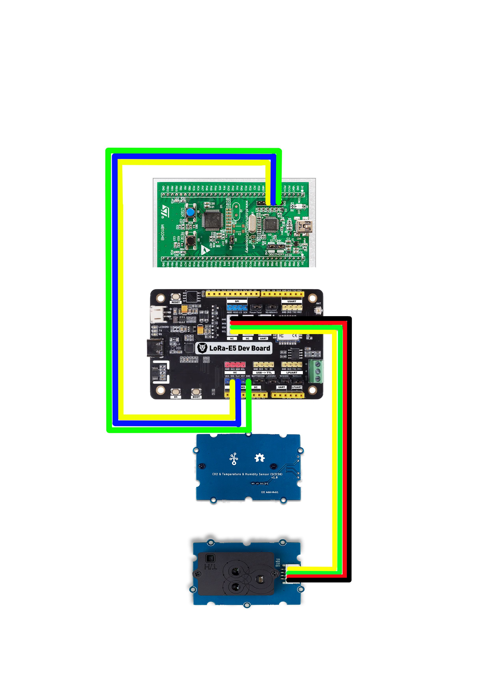
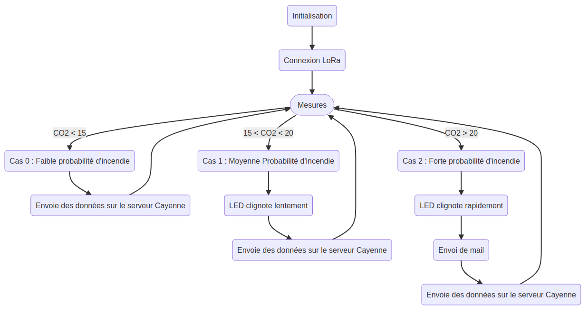
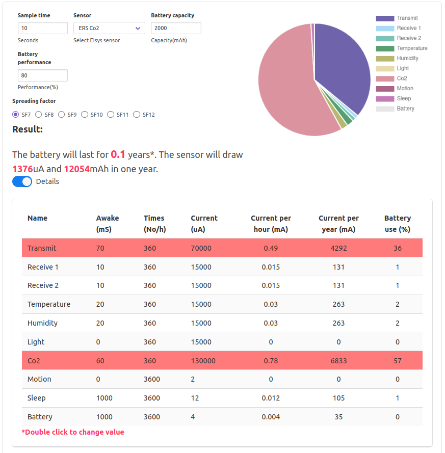
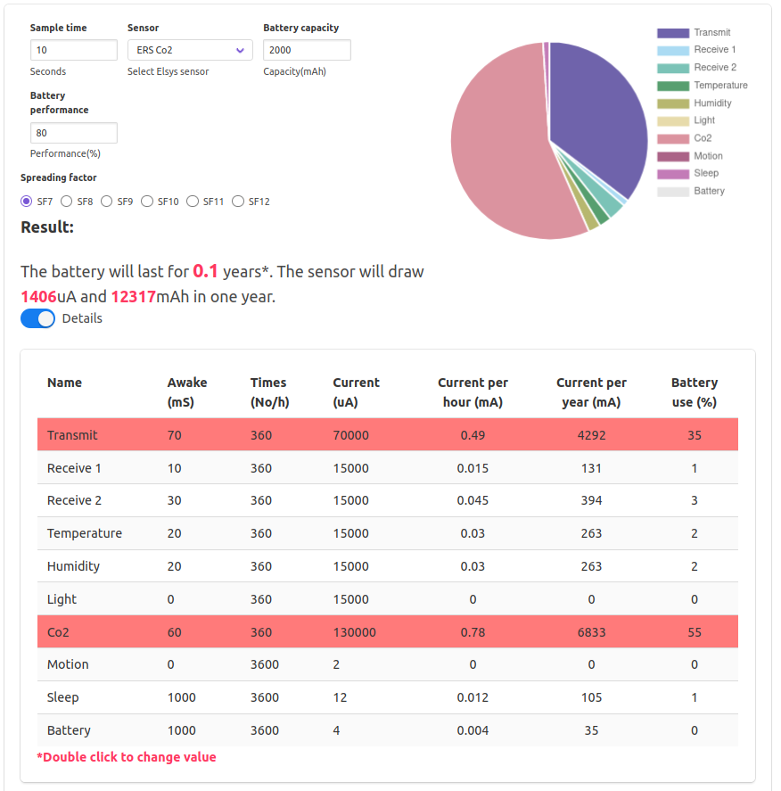
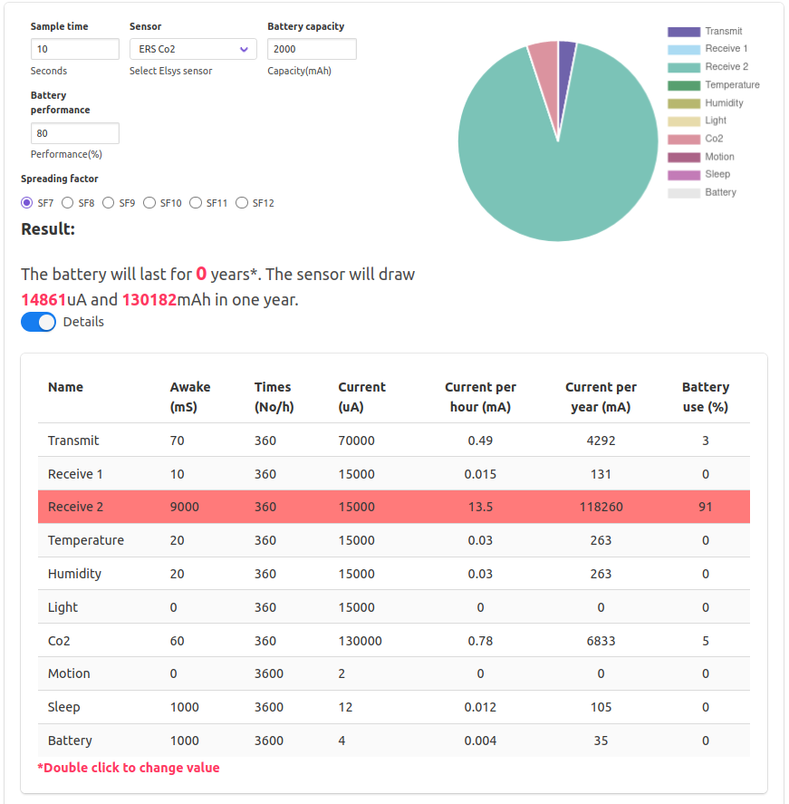

# Rapport Projet IOT

### Sommaire
* [Objectifs du Projet](#objectifs-du-projet)
* [Architecture globale du réseau de sirènes](#architecture-globale-du-réseau-de-sirènes)
* [Sécurité globale](#sécurité-globale)
* [Architecture matérielle](#architecture-matérielle)
* [Coût de la BOM (Bill Of Materials) pour 5000 unités](#coût-de-la-bom-pour-5000-unités)
* [Coût des certifications](#coût-des-certifications)
* [Implémentation logicielle](#implémentation-logicielle)
* [Format LPP des messages](#format-lpp-des-messages)
* [Logiciel embarqué de l'objet sirène](#logiciel-embarqué-de-lobjet-sirène)
* [Métriques logicielles](#métriques-logicielles)
* [Changement de comportement de l'objet en fonction des évènements](#changement-de-comportement-de-lobjet-en-fonction-des-évènements)
* [Durée de vie de la batterie](#durée-de-vie-de-la-batterie)
* [Analyse du Cycle de Vie du produit](#analyse-du-cycle-de-vie-du-produit)
* [Avantages/Inconvénients des produits concurrents](#avantagesinconvénients-des-produits-concurrents)
* [Solutions utilisables pour localiser l'objet sirène](#solutions-utilisables-pour-localiser-lobjet-sirène)
* [Intégrations effectuées](#intégrations-effectuées)

## Objectifs du Projet
Le but de ce projet était de créer un détecteur d'incendie. Pour ce faire, nous avions à notre disposition une carte LoRa, une carte ST et des capteurs nécessaires pour détecter la présence d'un incendie (capteur de température, d'humidité, ...).
De plus, ce projet avait pour but de mettre en évidence la communication LoRa entre les mesures détectées et un serveur dédié (nous avons choisi d'utiliser Cayenne).

## Architecture globale du réseau de sirènes

## Sécurité globale
La sécurité de l'objet passe par une connexion sécurisé et phase de chiffrement point à point du message. Pour établir une connexion sécurisée, on utilise deux clés : APPEUI et DEVEUI et valent respectivement 0x0000000000000000 et 0x2E8A957A6601FB9C. Une fois la connexion sécurisée établie, toutes les données qui seront envoyées seront chiffrées grâce à une clé de chiffrage : APPKEY. Cette dernière vaut 0xD3747E67C62E09EA80471954877D3411 pour notre projet.

## Architecture matérielle
Notre objet est composé de 2 parties (3 en comptant la carte permettant de charger notre programme dans la carte LoRa). Nous avons donc : 
* La carte LoRa-E5 Dev qui va contenir le programme et qui va communiquer avec le serveur via le protocole LoRa.
* La carte SCD30 qui contient le capteur de température, le capteur d'humidité et le capteur de concentration de CO2.

Pour le carte SCD30, nous avons relié les ports SCL, SDA, GND et VCC au port série I2C de la carte LoRa-E5 Dev comme on peut le voir sur le schéma ci-dessous.

## Coût de la BOM pour 5000 unités
Coût de la carte LoRa : 26.90€.
Coût du capteur SCD30 : 68,80€.
Total : 95,70€.
Nous n'avons pas utilisé de buzzer pour ce projet car nous avons d'abord préféré nous concentrer sur la communication LoRa entre le serveur et notre système.
Donc notre coût total pour notre système global est de 5000*95,70 = 478500€.

## Coût des certifications
Pour la certification ETSI du produit, le coût serait de 300€/an. 
La certification LoRa Alliance coûte 10000$/an.

## Implémentation logicielle

## Format LPP des messages
Pour communiquer entre notre objet et notre serveur, nous envoyons des trames de messages. Ces messages sont découpés en 5 parties :
* Le cas de fonctionnement (0 pour fonctionnement normal, 1 pour un fonctionnement anormal et 2 pour un fonctionnement anormal ++) est envoyé sur le channel 0.
* La température qui va être mesurée par le capteur scd30 sur le channel 1.
* L'humidité qui va être mesurée par le capteur scd30 sur le channel 2.
* La concentration en CO2 qui va être mesurée par le capteur scd30 sur le channel 3.
* Le mode de fonctionnement (0 pour fonctionnement forcé et 1 pour fonctionnement classique) est envoyé sur le channel 4. 

## Logiciel embarqué de l'objet sirène

## Métriques logicielles
Nous avons 3 grandeurs mesurées : La température, l'humidité et la concentration en CO2.
* La température est mesurée en °C.
* L'humidité est mesurée en %.
* La concentration de CO2 est mesurée en ppm/100 (partie par millions).

## Changement de comportement de l'objet en fonction des évènements
Tout d'abord, nous avons une première partie d'initialisation qui va nous permettre de mettre en place la communication LoRa avec le serveur. Ensuite, on réalise des mesures sur la température, l'humidité et la concentration de CO2. En fonction de la concentration de CO2, nous avons 3 cas possibles : 
* Cas 0 : La concentration de CO2 est inférieure à 15 ppm/100 donc il y a une faible probabilité d'avoir un incendie.
* Cas 1 : La concentration de CO2 est comprise entre 15 ppm/100 et 20 ppm/100 donc il y a une probabilité moyenne d'avoir un incendie.
* Cas 2 : La concentration de CO2 est supérieure à 20 ppm/100 donc il y a une forte probabilité d'avoir un incendie.
Le diagramme complet de notre système est :

## Durée de vie de la batterie
On souhaite estimer la durée de la batterie selon différentes classes. Ces classes correspondent aux méthodes utilisées par notre objet pour envoyer et recevoir des données du server. Chaque classe fonctionne d'une manière différente : 
* La classe A va, pour recevoir les données, envoyer un messages uplink pour que le serveur lui envoie les données. Ensuite, deux courtes plages de détection vont être placées pour détecter l'arrivée de messages downlink. Si un message downlink est détecté, alors on utilise une plus grande plage de détection pour récupérer le message et sinon, on n'utilise que les deux plages de détection. Cette méthode permet d'avoir une utilisation optimale de la batterie car on a des longues plages de temps pendant lesquelles on ne consomme pas de courant.
* La classe B va utiliser le même principe que la plage A mais en rajoutant des balises autour dans la plage de temps et une plage nommée 'ping slot'. Cette classe permet de recevoir des messages downlink sans envoyées de messages uplink. Cependant, la durée de vie de la batterie est plus courte car on utilise du courant pour réaliser les balises et le 'ping slot'.
* La classe C va, après avoir envoyé un message uplink, utiliser toute la plage de détection pour recevoir un message. Par conséquent, elle va consommer beaucoup de courant et réduire la durée de vie de la batterie.

Nous avons donc simulé la durée de vie de la batterie pour notre système en fonction des classes. Nous avons obtenu : 
Nous avons mis à 0 le capteur de lumière et le capteur de présence car nous ne les utilisons pas pour ce projet et nous avons modifié le temps pendant lequel le signal receive2 est réveillé.
* Pour la classe A : 

On remarque que notre capteur va utiliser 1376 µA et qu'on a 2000mAh en capacité totale de la batterie (cela correspond aux 2 piles présentes dans notre projet).
On en déduit donc que notre durée de vie est de : 60 jours avec la classe A.
* Pour la classe B :

On remarque que notre capteur va utiliser 1406 µA et qu'on a 2000mAh en capacité totale de la batterie (cela correspond aux 2 piles présentes dans notre projet).
On en déduit donc que notre durée de vie est de : 59 jours avec la classe B.
* Pour la classe C : 

On remarque que notre capteur va utiliser 14861µA et qu'on a 2000mAh en capacité totale de la batterie (cela correspond aux 2 piles présentes dans notre projet).
On en déduit donc que notre durée de vie est de : 5 jours.

 On remarque que la classe C est à éviter à tout prix du fait de son importante consommation pour un système qui n'en a pas réellement besoin.
## Analyse du Cycle de Vie du produit

## Avantages/Inconvénients des produits concurrents
| Produit | Avantages | Inconvénients |
| :-----: | :-------: | :-----------: |
| MClimate CO2 Sensor & Notifier | <ul><li>Faible consommation électrique : 2 AA</li><li>Durée de vie : 10 ans</li><li>Prix : 160€</li></ul> | <ul><li>Faible bruit : 8 dB (risque de ne pas entendre l'alarme)</li><li>Ne fonctionne pas avec des batteries rechargeables</li></ul> |

## Solutions utilisables pour localiser l'objet sirène
Pour localiser l'antenne, nous pourrions utiliser le magnétomètre présent sur la carte LoRa et en déduire ses coordonnées grâce au champ magnétique terrestre. Ensuite, les coordonées seraient ajoutées dans la trame des messages envoyées au serveur Cayenne.
Une autre idée serait de définir dans le programme les coordonnées de l'objet et de les envoyer au serveur quand on appuie sur un bouton qui fonctionnerait avec une interruption pour éviter de bloquer le programme en utilisant le processeur en continu.

## Intégrations effectuées
La seule intégration que nous avons utilisé est Cayenne pour l'affichage des données.
